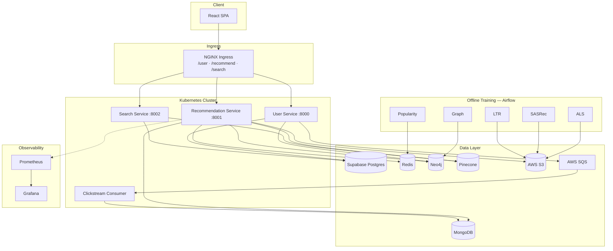
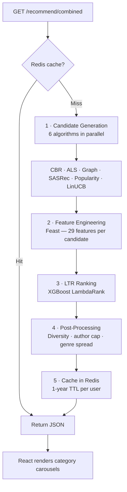

# BibliophileAI

**A production-grade social book recommendation platform — 6 ML algorithms, XGBoost learning-to-rank, real-time monitoring, and a full ML retraining lifecycle on Kubernetes.**

[Problem](#-problem) • [Architecture](#-architecture) • [Pipeline](#-recommendation-pipeline) • [Monitoring](#-monitoring--observability) • [Stack](#-stack) • [Setup](SETUP.md)

---

## Problem

Most book discovery experiences are either too generic (bestseller lists) or too narrow (you liked X, here's more X). Neither handles the real challenges well:

- **Cold start** — new users have no history; new books have no ratings
- **Data sparsity** — users interact with <0.1% of the catalog, making collaborative signals unreliable
- **Filter bubbles** — single-algorithm systems over-exploit known preferences, missing serendipitous finds
- **Stale models** — batch-trained systems don't adapt to recent user behaviour

---

## What BibliophileAI Does

A Netflix-style recommendation feed built on a hybrid ensemble that attacks each problem directly:

| Problem | Solution |
|---------|---------|
| Cold start | Content-based filtering (Pinecone ANN on book embeddings) works day one with declared preferences |
| Data sparsity | 6 algorithms contribute candidates — CBR, ALS, Graph, SASRec, Popularity, LinUCB — any one can fill gaps when others are sparse |
| Filter bubbles | Post-processing enforces: max 3 books per author, min 4 genres in top-10, novelty boost, serendipity injection |
| Stale models | Airflow DAGs retrain ALS/Graph/SASRec/LTR daily, Popularity hourly; LinUCB updates online per user |

All candidates are re-ranked by an XGBoost LambdaRank model trained on 29 engineered features (retrieval scores, social signals, session context, popularity). Results are cached per user with background refresh on engagement events.

---

## Architecture

```mermaid
flowchart TB
    subgraph Client
        SPA["React SPA"]
    end
    subgraph Ingress
        NGINX["NGINX Ingress<br/>/user · /recommend · /search"]
    end
    subgraph K8s["Kubernetes Cluster"]
        US["User Service :8000"]
        RS["Recommendation Service :8001"]
        SS["Search Service :8002"]
        CC["Clickstream Consumer"]
    end
    subgraph Data["Data Layer"]
        PG[("Supabase Postgres")]
        RD[("Redis")]
        N4J[("Neo4j")]
        PC[("Pinecone")]
        MG[("MongoDB")]
        S3[("AWS S3")]
        SQS["AWS SQS"]
    end
    subgraph Training["Offline Training — Airflow"]
        ALS["ALS"]
        GR["Graph"]
        SR["SASRec"]
        POP["Popularity"]
        LTR["LTR"]
    end
    subgraph Monitor["Observability"]
        Prom["Prometheus"]
        Graf["Grafana"]
    end

    SPA --> NGINX --> US & RS & SS
    US --> PG & N4J & SQS
    RS --> RD & N4J & PC & MG & S3
    SS --> PC & PG
    SQS --> CC --> MG
    ALS & SR & LTR --> S3
    GR --> N4J
    POP --> RD
    RS -.-> Prom --> Graf
```

---

## Recommendation Pipeline

Every `/recommend/combined` request follows a 5-stage pipeline. Cache hits skip straight to the response.

```mermaid
flowchart TB
    A["GET /recommend/combined"] --> B{"Redis cache?"}
    B -->|Hit| N["Return JSON"]
    B -->|Miss| C["1 · Candidate Generation<br/>6 algorithms in parallel"]
    C --> D["CBR · ALS · Graph · SASRec · Popularity · LinUCB"]
    D --> E["2 · Feature Engineering<br/>Feast — 29 features per candidate"]
    E --> F["3 · LTR Ranking<br/>XGBoost LambdaRank"]
    F --> G["4 · Post-Processing<br/>Diversity · author cap · genre spread"]
    G --> H["5 · Cache in Redis<br/>1-year TTL per user"]
    H --> N
    N --> O["React renders category carousels"]
```

### Stage breakdown

| Stage | Detail |
|-------|--------|
| **Candidate generation** | 6 algorithms run concurrently, each returning up to 200 candidates (~1 000 total after dedup) |
| **Feature engineering** | 29 features via Feast: 6 retrieval scores, metadata match, social graph signals, session context, device type, popularity windows |
| **LTR ranking** | XGBoost LambdaRank (`rank:ndcg`) loaded from S3; trained offline on MongoDB engagement labels |
| **Post-processing** | Max 3 books per author · min 4 genres in top-10 · novelty boost · serendipity injection |
| **Caching** | Result stored at `recommend:combined:{user_id}` (TTL 1 year); background refresh triggered by user events |

### Algorithms

| Algorithm | Source | Strength |
|-----------|--------|----------|
| Content-Based (CBR) | Pinecone ANN — `llama-text-embed-v2` | Cold start, semantic similarity |
| Collaborative Filtering (ALS) | Implicit ALS factors on S3 | Long-term preference patterns |
| Graph-Based | Neo4j Personalized PageRank | Social signals, friend influence |
| SASRec | PyTorch self-attention transformer | Session dynamics, recency |
| Popularity | Redis time-decay scores (7d / 30d / 90d) | Trending, universal fallback |
| LinUCB | Per-user bandit state in Redis | Exploration-exploitation balance |

---

## Monitoring & Observability

Prometheus + Grafana with a metrics sidecar pattern — each pod writes JSON to a shared emptyDir; the sidecar exposes it as Prometheus gauges.

**Tracked metrics:**

| Category | Metrics |
|----------|---------|
| Latency | Pipeline P50 / P95 / P99 (rolling 500-sample window) |
| Cache | Hit rate, miss rate, impressions served |
| Ranking quality | NDCG@10 (engagement-weighted, position-attributed) |
| Engagement | CTR proxy, bookmark rate, review rate, engagement by rank position |
| Algorithms | Candidates retrieved per algorithm (cumulative) |
| Infrastructure | Pod health, CPU, running/failed pods, HTTP error rate |

**Alerting rules (PrometheusRule):**
- P95 latency > 3 min for 5m → warning
- P99 latency > 4.5 min → critical (approaching 300s Ingress timeout)
- Cache hit rate < 20% for 10m
- Any service sidecar down for 2m
- Pod CrashLoopBackOff
- NDCG@10 < 0.3 for 30m

**Offline evaluation:** Each LTR training run computes NDCG@3 / @5 / @10 on a held-out 20% query split and saves `eval_metrics_latest.json` to S3 alongside the model.

---

## Data Layer

Each store is chosen for its access pattern — not convenience.

| Store | Role |
|-------|------|
| **Supabase (PostgreSQL)** | Users, books, ratings, bookmarks, preferences — transactional source of truth |
| **MongoDB** | Clickstream events → relevance labels for LTR training |
| **Neo4j** | Social graph: FOLLOWS, READ, RATED, WROTE, HAS_GENRE — feeds graph algorithm and social features |
| **Redis** | Recommendation cache · Feast online store · LinUCB bandit state · popularity scores |
| **Pinecone** | Book and user embeddings (1024-dim) for ANN search |
| **AWS S3** | Trained model artifacts · Feast offline Parquet features · EPUBs |
| **AWS SQS** | FIFO event queue: user service → clickstream consumer |

---

## Stack

**Backend:** FastAPI · PyTorch · XGBoost · Ray · Feast · Implicit (ALS) · Neo4j driver · Pinecone · Boto3 · Passlib (Argon2) · PyJWT

**Frontend:** React 19 · TypeScript · Vite 7 · Bootstrap 5 · React Router · `@react-oauth/google` · `react-reader`

**Infrastructure:** Kubernetes (Kind) · Docker · NGINX Ingress · Apache Airflow · Prometheus · Grafana · GitHub Actions CI · AWS (S3, SQS)

---

## Getting Started

See [SETUP.md](SETUP.md) for the full deployment guide.

**Prerequisites:** Docker · kubectl · Kind · Helm 3 · Node.js 18+ · Python 3.9+

**External services required:** Supabase · MongoDB Atlas · Neo4j Aura · Pinecone · AWS (S3 + SQS FIFO) · Google OAuth

---

## License

[MIT](LICENSE)
