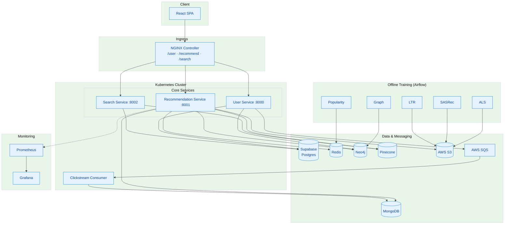
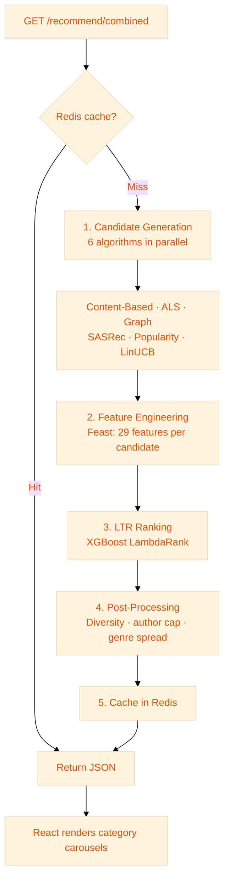

# BibliophileAI: Social Book Recommendation Platform

**A production-grade book recommendation system combining 6 ML algorithms, XGBoost learning-to-rank, and a Feast feature store — deployed on Kubernetes with Airflow-orchestrated daily retraining.**

[Architecture](#-system-architecture) • [Pipeline](#-recommendation-pipeline) • [Services](#-services) • [Tech Stack](#-technology-stack) • [Getting Started](#-getting-started)

---

## What is this?

BibliophileAI is a social book recommendation platform that delivers a Netflix-style personalized feed. Users discover books through content similarity, collaborative filtering, social graph signals, session behavior, and trending data — all combined via a learning-to-rank model.

**Key design goals:**
- Hybrid recommendation ensemble (6 algorithms) with XGBoost reranking
- Event-driven clickstream pipeline (AWS SQS → MongoDB → daily retraining)
- Polyglot persistence: each store chosen for its access pattern
- Kubernetes-native deployment with Prometheus/Grafana observability

**Limitations to be aware of:**
- Requires several external managed services (Supabase, MongoDB, Neo4j, Pinecone, AWS)
- First recommendation request on cache miss can take 1–2 minutes (Ingress timeout is set to 300s)
- Models are retrained offline (daily/hourly via Airflow); recommendations lag behind the latest events

---

## System Architecture

*React SPA → NGINX Ingress → User / Recommendation / Search services → Supabase, Redis, Neo4j, Pinecone, MongoDB, S3, SQS → Clickstream Consumer → Airflow training jobs → Prometheus + Grafana.*

```mermaid
%%{init: {'theme':'base', 'themeVariables': { 'primaryColor':'#E3F2FD', 'primaryTextColor':'#0D47A1', 'primaryBorderColor':'#1976D2', 'lineColor':'#424242', 'secondaryColor':'#F3E5F5', 'tertiaryColor':'#E8F5E9' }}}%%
flowchart TB
    subgraph Client["Client"]
        SPA["React SPA"]
    end

    subgraph Ingress["Ingress"]
        NGINX["NGINX Controller\n/user · /recommend · /search"]
    end

    subgraph K8s["Kubernetes Cluster"]
        subgraph Services["Core Services"]
            US["User Service :8000"]
            RS["Recommendation Service :8001"]
            SS["Search Service :8002"]
        end
        CC["Clickstream Consumer"]
    end

    subgraph Data["Data & Messaging"]
        Supabase[("Supabase\nPostgres")]
        Redis[("Redis")]
        Neo4j[("Neo4j")]
        Pinecone[("Pinecone")]
        MongoDB[("MongoDB")]
        S3[("AWS S3")]
        SQS["AWS SQS"]
    end

    subgraph Training["Offline Training (Airflow)"]
        ALS["ALS"]
        Graph["Graph"]
        LTR["LTR"]
        Pop["Popularity"]
        SasRec["SASRec"]
    end

    subgraph Monitor["Monitoring"]
        Prom["Prometheus"]
        Grafana["Grafana"]
    end

    SPA --> NGINX
    NGINX --> US & RS & SS
    US --> Supabase & Neo4j & SQS
    RS --> Redis & Neo4j & Pinecone & MongoDB & S3
    SS --> Pinecone & Supabase
    SQS --> CC --> MongoDB
    ALS & SasRec & LTR --> S3
    Graph --> Neo4j
    Pop --> Redis
    RS -.-> Prom --> Grafana
```

---

## Recommendation Pipeline

Every request follows a 5-stage pipeline. Results are cached in Redis per user (1-year TTL); subsequent loads are fast.

```mermaid
%%{init: {'theme':'base', 'themeVariables': { 'primaryColor':'#FFF3E0', 'primaryTextColor':'#E65100' }}}%%
flowchart TB
    A[GET /recommend/combined] --> B{Redis cache?}
    B -->|Hit| N[Return JSON]
    B -->|Miss| C[1. Candidate Generation\n6 algorithms in parallel]
    C --> D[Content-Based · ALS · Graph\nSASRec · Popularity · LinUCB]
    D --> E[2. Feature Engineering\nFeast: 29 features per candidate]
    E --> F[3. LTR Ranking\nXGBoost LambdaRank]
    F --> G[4. Post-Processing\nDiversity · author cap · genre spread]
    G --> H[5. Cache in Redis]
    H --> N
    N --> O[React renders category carousels]
```

### Pipeline Stages

| Stage | What happens |
|-------|-------------|
| **Candidate Generation** | 6 algorithms run in parallel, each returning up to 200 candidates (~1000 total after dedup) |
| **Feature Engineering** | 29 features fetched from Feast (retrieval scores, metadata match, social signals, session context, popularity) |
| **LTR Ranking** | XGBoost LambdaRank model (loaded from S3) scores and sorts candidates |
| **Post-Processing** | Max 3 books per author, min 4 genres in top-10, novelty boost, serendipity injection |
| **Caching** | Final result stored in Redis at `recommend:combined:{user_id}` (TTL: 1 year); background refresh triggered on user events |

### Algorithms

| Algorithm | Source | Handles |
|-----------|--------|---------|
| Content-Based (CBR) | Pinecone ANN | Cold start, semantic similarity |
| Collaborative Filtering (ALS) | S3 factor matrices | User-item preference patterns |
| Graph-Based | Neo4j Personalized PageRank | Social signals, friend influence |
| SASRec | PyTorch transformer (S3 checkpoint) | Session dynamics, recency |
| Popularity | Redis time-decay scores | Trending, fallback |
| LinUCB | Redis per-user bandit state | Exploration-exploitation balance |

---

## Services

### User Service (`src/user_service/` · port 8000)
Auth (JWT + Google OAuth2), user profiles, preferences, bookmarks, reviews, social graph (follows), and clickstream event emission to SQS.

### Recommendation Service (`src/recommendation_service/` · port 8001)
Runs the full 5-stage pipeline. Also exposes internal endpoints (`/internal/recommend/{category}`) for background cache refresh triggered by the user service.

### Search Service (`src/search_service/` · port 8002)
Semantic search: embeds the query and runs ANN search on the Pinecone book index, then fetches metadata from Supabase.

### Clickstream Consumer (`src/clickstream_consumer/`)
Long-polls the SQS FIFO queue (20s wait), persists events to MongoDB, and deletes processed messages.

### Model Training (`src/model_training_service/`)
Five Ray-based training scripts run as Kubernetes pods via Airflow `KubernetesPodOperator`:

| Job | Schedule | Output |
|-----|----------|--------|
| ALS | Daily | User/item factors → S3 |
| SASRec | Daily | Transformer checkpoint → S3 |
| Graph | Daily | PPR scores → Neo4j |
| LTR | Daily | XGBoost model → S3 |
| Popularity | Hourly | Time-decay scores → Redis + S3 |

---

## Data Layer

| Store | Purpose |
|-------|---------|
| **Supabase (PostgreSQL)** | Users, books, ratings, bookmarks, preferences |
| **MongoDB** | Clickstream events → training labels |
| **Neo4j** | Social graph: FOLLOWS, READ, RATED, WROTE, HAS_GENRE |
| **Redis** | Recommendation cache, Feast online store, LinUCB state, popularity scores |
| **Pinecone** | Book and user embeddings (llama-text-embed-v2, 1024-dim) |
| **AWS S3** | Trained model artifacts, Feast offline Parquet features, EPUBs |
| **AWS SQS** | Clickstream event queue (FIFO, ordered per user) |

---

## Technology Stack

**Backend:** FastAPI · PyTorch · XGBoost · Ray · Feast · Implicit (ALS) · Neo4j driver · Pinecone SDK · Boto3 · Passlib (Argon2) · PyJWT

**Frontend:** React 19 · TypeScript · Vite 7 · Bootstrap 5 · React Router · `@react-oauth/google` · react-reader

**Infrastructure:** Kubernetes (Kind) · Docker · NGINX Ingress · Apache Airflow · Prometheus · Grafana · AWS (S3, SQS)

---

## Getting Started

See [SETUP.md](SETUP.md) for the full step-by-step guide. The short version:

1. Install prerequisites: Docker, kubectl, Kind, Helm 3, Node.js 18+, Python 3.9+
2. Create accounts: Supabase, MongoDB Atlas, Neo4j Aura, Pinecone, AWS (S3 + SQS FIFO), Google OAuth
3. Clone → create Kind cluster → fill in and apply `kubernetes/secrets.yaml`
4. Deploy Redis instances, build/load Docker images, install Ingress, apply deployment YAMLs
5. Port-forward Ingress on `8080:80`, then run the frontend (`npm run dev` on port 5173)
6. (Optional) Run book data importers, install monitoring, set up Airflow training jobs

---

## Contributing

See [CONTRIBUTING.md](CONTRIBUTING.md). PRs welcome — please open an issue first for significant changes.

---

## License

[MIT](LICENSE)
