# 📚 BibliophileAI: Next-Generation Social Book Recommendation Platform

<div align="center">

[](https://python.org)
[](https://fastapi.tiangolo.com)
[](https://reactjs.org)
[](https://pytorch.org)
[](https://neo4j.com)
[](https://kubernetes.io)
[](https://kafka.apache.org)
[](https://ray.io)
[](https://opensource.org/licenses/MIT)

**A production-grade recommendation system combining 6 recommendation algorithms, Ray-based distributed training, XGBoost learning-to-rank, and Feast feature store to deliver hyper-personalized book recommendations at scale.**

[Features](#-key-features) • [Architecture](#️-system-architecture) • [ML Pipeline](#-recommendation-pipeline) • [Technology](#️-technology-stack) • [Contributing](#-contributing)

</div>

---

## 🎯 Overview

BibliophileAI is a sophisticated book recommendation platform that combines classical recommendation algorithms, deep learning, and graph-based social intelligence. Built on a modern microservices foundation with polyglot persistence, it processes millions of interactions in real-time while delivering sub-100ms recommendation latency.

This project represents a production-grade implementation of hybrid recommendation systems, comparable to the recommendation engines powering Netflix, Spotify, and Amazon. It addresses fundamental challenges identified in recent recommendation systems research, including cold start problems, data sparsity, gray sheep users, scalability bottlenecks, and the exploration-exploitation trade-off.

### 🌟 Core Capabilities

- **🧠 Research-Grade ML**: Implements state-of-the-art algorithms from top-tier RecSys, KDD, and SIGIR papers
- **🌐 Multi-Database Architecture**: Leverages PostgreSQL, MongoDB, Neo4j, Redis, and Pinecone for optimal performance
- **📡 Event-Driven Design**: Real-time user behavior processing with Apache Kafka streaming
- **🤝 Social Intelligence**: Graph-based recommendations using Neo4j and PageRank algorithms
- **⚡ Sub-100ms Latency**: Multi-stage ranking pipeline with intelligent caching
- **📖 Open Library Integration**: Powered by Gutendex API for Project Gutenberg's collection

### 🎓 What Makes This Different from Academic Projects

Most recommendation system projects implement a single algorithm or use simplified datasets. BibliophileAI goes further by:

- **Production Architecture**: Full microservices stack with proper separation of concerns, not monolithic notebooks
- **Multi-Algorithm Ensemble**: Six different recommendation algorithms working together, not just collaborative filtering
- **Real-Time Processing**: Event streaming with Kafka for live user behavior tracking
- **Social Graph Integration**: Neo4j graph database for relationship-based recommendations
- **Scalability by Design**: Kubernetes orchestration, horizontal scaling, and caching strategies
- **Complete ML Lifecycle**: Ray-based distributed training, Feast feature store, XGBoost learning-to-rank, and diversity-aware post-processing
- **Explainable Recommendations**: Users understand why books are recommended to them

### 🔬 Addressing Research Challenges

Recent surveys on recommender systems have identified critical unsolved problems that plague even state-of-the-art implementations. BibliophileAI's architecture specifically addresses these challenges:

**The Evaluation Inconsistency Problem**: Research papers use incompatible metrics—some report MAE/RMSE for rating prediction while others use NDCG/Recall@K for ranking tasks, making direct comparison impossible. BibliophileAI implements a comprehensive evaluation framework covering all five metric types: similarity measures, candidate generation metrics, predictive accuracy, ranking quality, and business KPIs (CTR, conversion rate, user retention).

**The Cold Start Paradox**: Most hybrid systems claim to solve cold start but only handle new users OR new items, not both simultaneously. BibliophileAI addresses this comprehensively through:
- Content-based filtering with Pinecone for new users (using declared preferences)
- Popularity-based promotion for new books (time-decayed trending scores)
- Graph-based social recommendations for users with friend connections
- Active learning through strategic preference elicitation
- LLM-based explanations leveraging world knowledge for unfamiliar items

**The Gray Sheep Problem**: Users with unique tastes that don't align with any cluster are poorly served by collaborative filtering. Research shows these users receive significantly worse recommendations than mainstream users. BibliophileAI detects gray sheep through clustering analysis and automatically adjusts the ensemble weights:
- Increase content-based filtering weight (from 20% to 60%)
- Boost diversity metrics to show broader genre range
- Reduce collaborative filtering reliance (which fails for outlier users)
- Prioritize novelty over popularity to encourage exploration

**The Scalability-Accuracy Trade-off**: Deep learning models and GNNs achieve higher accuracy but introduce prohibitive computational costs. LLM-based generative recommenders can take >1 second per recommendation, unsuitable for real-time serving. BibliophileAI solves this through:
- Multi-stage ranking: Fast algorithms retrieve 1000 candidates, expensive models score only top 500
- Approximate nearest neighbors with Pinecone (sub-50ms vector search)
- Multi-level caching strategy: L1 (Redis 5-min), L2 (Application), L3 (CDN)
- Model quantization and ONNX optimization for inference acceleration
- Kubernetes horizontal pod autoscaling based on request latency

**The Explainability-Accuracy Trade-off**: Traditional matrix factorization offers natural explainability but limited accuracy. Deep learning and GNNs sacrifice interpretability for performance. BibliophileAI achieves both through:
- Tracking recommendation sources (which algorithm contributed each candidate)
- LLM-based explanation generation that's truthful to model internals
- Feature importance from XGBoost ranking model
- Transparent social signals ("3 friends read this book")

**The Noisy Social Graph Problem**: Real-world social networks contain noisy and redundant connections that hurt recommendation quality. Simply using raw social graphs can decrease performance. BibliophileAI implements graph denoising through:
- Information bottleneck objectives to learn minimal, relevant subgraphs
- Preference-guided attention mechanisms (Neo4j graph algorithms)
- HSIC (Hilbert-Schmidt Independence Criterion) for redundancy removal
- This approach has shown >10% NDCG improvement in research settings

**The Dynamic Preferences Challenge**: User tastes evolve over time and vary by context (time of day, mood, device, session intent). Static user profiles fail to capture these temporal dynamics. BibliophileAI addresses this through:
- Sequential models (SASRec) capturing long-term preference evolution
- Session-based models for short-term intent within browsing sessions
- Real-time embedding updates after significant interactions
- Contextual features: time of day, device type, session position

### 📊 Beyond-Accuracy Objectives

Modern recommender systems research emphasizes that accuracy alone is insufficient for user satisfaction. BibliophileAI is architected to optimize multiple objectives simultaneously:

**Diversity**: Prevents filter bubbles by ensuring recommendations span multiple genres and authors. Post-processing stage enforces maximum 3 books per author and minimum 4 different genres in top-10 recommendations.

**Novelty and Serendipity**: Balances safe, relevant recommendations with surprising discoveries. Novelty scoring boosts lesser-known books (those outside user's past interactions), while serendipity metrics identify recommendations that are both unexpected and highly rated.

**Fairness and Bias Mitigation**: Prevents amplification of popularity bias (rich-get-richer effect) where popular books dominate recommendations. Catalog coverage metrics ensure long-tail items receive exposure. Demographic fairness ensures equitable recommendations across user segments.

**Explainability and Trust**: Generates natural language explanations for each recommendation using multiple signal types:
- Content similarity: "Because you liked [Book X] which shares similar themes"
- Collaborative signals: "Readers with similar tastes also enjoyed this"
- Social proof: "3 of your friends read this book"
- Trending: "Popular this week among [Genre] readers"
- Author connection: "New release from [Author Y] whom you follow"

---

## 🏗️ System Architecture

### High-Level Architecture Diagram


### Architecture Principles

- **Separation of Concerns**: Each service has a single, well-defined responsibility
- **Event-Driven Communication**: Asynchronous processing for high throughput
- **Multi-Stage Ranking**: Candidate generation → Feature engineering → Ranking → Post-processing
- **Polyglot Persistence**: Right database for the right data pattern
- **Horizontal Scalability**: Stateless services that scale independently

---

## 🔧 Microservices Overview

### 👤 User Service
Handles authentication, profile management, and user preference orchestration. Implements secure JWT-based authentication with Argon2 hashing, Google OAuth integration, and multi-dimensional preference tracking (genres, authors, demographics). Automatically generates user embeddings for the recommendation engine upon preference updates.

**Key Features:** Custom authentication with SHA-256 pre-hashing + Argon2, Google OAuth, preference collection, user embedding generation, popular author discovery.

**Tech Stack:** FastAPI, Supabase (PostgreSQL), JWT, OAuth 2.0, Passlib

---

### 📖 Recommendation Service
Core ML engine that generates personalized book recommendations using a multi-model ensemble approach. Combines content-based filtering, collaborative filtering, deep learning, and graph-based algorithms with dynamic weighting. Provides explainable AI with natural language reasoning for each recommendation.

**Key Features:** Multi-model ensemble, real-time inference (<100ms), cold start handling, social-aware recommendations, A/B testing framework, gray sheep handling, real-time adaptation.

**Tech Stack:** PyTorch, TorchServe, Scikit-learn, Neo4j GDS, Pinecone, Redis, XGBoost

#### Recommendation Service Architecture

```mermaid
graph TB
    subgraph "API Endpoints"
        Combined[/api/v1/recommend/combined]
        Content[/api/v1/recommend/content]
        Graph[/api/v1/recommend/graph]
        Session[/api/v1/recommend/session]
        Popularity[/api/v1/recommend/popularity]
    end
    
    subgraph "Algorithm Modules"
        CB[Content-Based<br/>Pinecone]
        CF[Collaborative Filtering<br/>ALS]
        GR[Graph Recommendation<br/>Neo4j]
        SR[SASRec<br/>Session-Based]
        POP[Popularity<br/>Time-Decayed]
        LIN[LinUCB<br/>Contextual Bandit]
    end
    
    subgraph "Feature Engineering"
        FE[Feature Service<br/>50+ Features]
    end
    
    subgraph "Ranking"
        XGB[XGBoost<br/>LambdaRank]
    end
    
    Combined --> CB
    Combined --> CF
    Combined --> GR
    Combined --> SR
    Combined --> POP
    Combined --> LIN
    
    CB --> FE
    CF --> FE
    GR --> FE
    SR --> FE
    POP --> FE
    LIN --> FE
    
    FE --> XGB
    XGB --> Combined
    
    Content --> CB
    Graph --> GR
    Session --> SR
    Popularity --> POP
    
    style Combined fill:#4CAF50,color:#fff
    style XGB fill:#FF9800,color:#fff
```

---

### 📊 Data Ingestion Service
Real-time event streaming pipeline that captures user interactions and distributes them across multiple databases. Processes 15+ interaction types including clicks, views, reads, ratings, bookmarks, and social activities. Ensures data quality through validation and anomaly detection.

**Key Features:** Event collection with sub-second latency, Kafka streaming with exactly-once semantics, multi-database routing, schema validation.

**Tech Stack:** Apache Kafka, FastAPI, Pydantic, MongoDB

#### Data Flow Architecture


---

### 🔧 Feature Engineering Service
Transforms raw data into ML-ready features for training and inference. Generates 29 features including retrieval scores from all 6 algorithms, user-book metadata matching, social graph metrics, temporal features, and contextual signals. Features are stored in Feast feature store (S3 Parquet) for training the learning-to-rank model.

**Key Features:** 29-feature vector generation, retrieval scores from all algorithms, social graph features (Neo4j), contextual features, Feast feature store integration, batch feature storage to S3.

**Tech Stack:** Pandas, Neo4j Graph Data Science, Feast (Feature Store), Redis, S3

---

### 🤖 Model Training Service
Automated ML pipeline for continuous model improvement using Ray framework for distributed training. Handles data preparation, multi-algorithm training across 6 recommendation algorithms, model validation, and deployment. All training jobs run as Kubernetes pods orchestrated by Apache Airflow.

**Key Features:** Scheduled retraining via Airflow DAGs, Ray-based distributed training, multi-algorithm training (ALS, Graph, SASRec, Popularity, LinUCB), model validation, automated S3 model storage.

**Tech Stack:** Apache Airflow, Ray, PyTorch, Scikit-learn, Implicit (ALS), Node2Vec, S3

**Training Algorithms:**
- **ALS (Collaborative Filtering)**: Matrix factorization using Implicit library, trained with Ray remote functions
- **Graph Analytics**: Node2Vec embeddings + PageRank scores computed with Ray
- **SASRec (Sequential)**: Transformer-based session model trained with PyTorch and Ray
- **Popularity**: Time-decayed scoring with exponential decay, computed with Ray workers
- **LinUCB**: Contextual bandit for exploration-exploitation balance

#### Training Pipeline Architecture


---

## 💾 Multi-Database Architecture

BibliophileAI employs a **polyglot persistence strategy**, where each database is chosen based on its strengths for specific access patterns and data characteristics. This approach is inspired by large-scale production systems at companies like LinkedIn, Uber, and Netflix.

### Database Architecture Diagram


### Database Usage Matrix

| Database | Purpose | Data Types | Access Pattern | Latency |
|----------|---------|------------|----------------|---------|
| **PostgreSQL (Supabase)** | Transactional data | Users, books, ratings, reviews, preferences | ACID transactions, JOINs | ~10-50ms |
| **MongoDB** | Event logs | User interactions, session data, time-series events | High write throughput, aggregations | ~5-20ms |
| **Neo4j** | Social graph | User connections, communities, relationships | Graph traversals, PPR | ~20-100ms |
| **Redis** | Caching & sessions | Recommendation cache, feature cache, counters | Key-value, sorted sets | <1ms |
| **Pinecone** | Vector search | Book/user embeddings, similarity indices | ANN similarity search | ~20-50ms |
| **AWS S3** | Model artifacts | Trained models, feature stores, batch data | Object storage, batch reads | ~100-500ms |

### Why Multiple Databases?

**PostgreSQL** excels at ACID transactions and complex JOINs for relational data like user profiles and book metadata. Its strong consistency guarantees ensure data integrity for critical operations like authentication and ratings.

**MongoDB** provides flexible schema and high write throughput for event logs. Its document model naturally fits JSON-like interaction events, and time-series collections optimize for temporal queries essential in behavioral analysis.

**Neo4j** is purpose-built for graph traversals. Finding friends-of-friends, computing centrality measures, and detecting communities are orders of magnitude faster than equivalent SQL queries. This powers our social recommendation features.

**Redis** delivers sub-millisecond read/write latency with its in-memory architecture. Critical for caching hot recommendations, storing session state, and maintaining real-time popularity counters that would overwhelm traditional databases.

**Pinecone** specializes in approximate nearest neighbor search across high-dimensional vectors. It enables semantic similarity searches that would be computationally infeasible with traditional databases, crucial for content-based filtering.

**S3** provides durable, versioned storage for large objects like trained ML models and historical feature datasets. Its integration with Spark and other big data tools makes it ideal for batch processing workflows.

---

## 🤖 Recommendation Pipeline

### End-to-End Flow Diagram

```mermaid
flowchart TD
    Start[User Request] --> Cache{Check Redis Cache}
    Cache -->|Hit| Return[Return Cached Results]
    Cache -->|Miss| Stage1[STAGE 1: Candidate Generation<br/>Parallel Execution]
    
    Stage1 --> CB[Content-Based<br/>Pinecone ANN]
    Stage1 --> ALS[Collaborative Filtering<br/>Implicit ALS]
    Stage1 --> Graph[Graph-Based<br/>Neo4j PPR]
    Stage1 --> SASRec[SASRec<br/>Session-Based]
    Stage1 --> Pop[Popularity<br/>Time-Decayed]
    
    CB --> Merge[Merge Candidates<br/>~1000 unique items]
    ALS --> Merge
    Graph --> Merge
    SASRec --> Merge
    Pop --> Merge
    
    Merge --> Stage2[STAGE 2: Feature Engineering<br/>29 Features]
    
    Stage2 --> Features[Generate 29 Features:<br/>• 6 retrieval scores<br/>• 8 metadata features<br/>• 5 social features<br/>• 7 session features<br/>• 3 popularity features]
    
    Features --> Feast[Store in Feast<br/>Feature Store S3]
    
    Feast --> Stage3[STAGE 3: Learning-to-Rank<br/>XGBoost LambdaRank]
    
    Stage3 --> Rank[Load Features from Feast<br/>Score & Sort by Engagement]
    
    Rank --> Stage4[STAGE 4: Post-Processing<br/>Diversity Rules]
    
    Stage4 --> Filter[Diversity Filters:<br/>• Max 3 per author<br/>• Min 4 genres<br/>• Novelty boost<br/>• Deduplication<br/>• Serendipity shuffle]
    
    Filter --> Explain[Generate Explanations<br/>LLM-based]
    
    Explain --> Stage5[STAGE 5: Cache Results<br/>Redis 5-min TTL]
    
    Stage5 --> Return
    Return --> End[Final Top-N Recommendations]
    
    style Stage1 fill:#E3F2FD
    style Stage2 fill:#F3E5F5
    style Stage3 fill:#FFF3E0
    style Stage4 fill:#E8F5E9
    style Stage5 fill:#FCE4EC
```



### Detailed Pipeline Stages

### Multi-Stage Ranking Strategy

**Stage 1: Candidate Generation** - Fast retrieval of 200-1000 potential books from multiple sources. Each algorithm runs in parallel to maximize coverage and diversity.

**Stage 2: Feature Engineering** - Enrich each candidate with 29 features from all data sources. Features include 6 retrieval scores (one per algorithm), 8 metadata features (genre/author/rating matching), 5 social features (friend reads, social proximity), 7 session features (position, device, time), and 3 popularity features. All features are stored in Feast feature store (S3 Parquet) for training the learning-to-rank model.

**Stage 3: Learning-to-Rank (XGBoost)** - XGBoost LambdaRank model trained on 29 features from Feast feature store. Features include retrieval scores from all 6 algorithms, metadata matching, social signals, temporal patterns, and diversity metrics. The model learns optimal feature weights to predict engagement probability and ranks candidates accordingly.

**Stage 4: Post-Processing & Diversity Rules** - Apply diversity constraints:
- Maximum 3 books per author in top recommendations
- Minimum 4 different genres represented
- Novelty boosting for lesser-known books
- Deduplication across algorithm sources
- Serendipity injection through controlled randomization

**Stage 5: Caching** - Store results in Redis with 5-minute TTL for fast subsequent access. Invalidate cache on model updates or significant user interactions.

---

## 🧠 Machine Learning Algorithms

### Core Algorithms

| Algorithm | Technique | Purpose | Data Source | Training Framework |
|-----------|-----------|---------|-------------|-------------------|
| **Content-Based** | Sentence-BERT (768-dim) + Pinecone ANN | Semantic similarity, cold start | Book metadata, Pinecone vectors | Pre-computed embeddings |
| **Collaborative Filtering** | Implicit ALS (Alternating Least Squares) | User-item preference learning | MongoDB event logs | Ray + Implicit |
| **Graph-Based** | Node2Vec + Personalized PageRank | Social recommendations | Neo4j social graph | Ray + NetworkX |
| **Sequential Models** | SASRec (Self-Attentive Sequential) | Session-based next-item prediction | MongoDB session data | Ray + PyTorch |
| **Popularity-Based** | Time-Decayed Scoring | Trending books, serendipity | Redis counters + MongoDB | Ray workers |
| **Contextual Bandit** | LinUCB | Exploration-exploitation balance | All sources | Ray |
| **Learning-to-Rank** | XGBoost LambdaRank | Final ranking optimization | Feast feature store (29 features) | XGBoost |

### Algorithm Details

**Content-Based Filtering (Pinecone)**
- Uses llama-text-embed-v2 to generate 1024-dimensional embeddings from book metadata
- User embeddings computed as weighted average of preferred book vectors
- Cosine similarity search via Pinecone for sub-50ms latency
- Handles cold start by matching user preferences to book content

**Collaborative Filtering (Implicit ALS)**
- Matrix factorization on user-item interaction matrix
- Works with implicit feedback (clicks, reads, bookmarks)
- Learns 50-100 dimensional latent factors for users and items
- Scales to millions of users and books efficiently

**Graph-Based Recommendations (Node2Vec + PageRank)**
- Node2Vec learns node embeddings from Neo4j social graph structure
- Personalized PageRank computes book relevance based on user's social connections
- Incorporates friend preferences and community influence
- Trained with Ray for distributed graph processing
- Enables social-aware recommendations and serendipity

**Sequential Recommendations (SASRec)**
- Transformer-based self-attention over user's recent history
- Captures both short-term (session) and long-term preferences
- Predicts next-item probability distribution
- Adapts to current browsing context in real-time

**Popularity & Trending**
- Time-decay formula: `score = Σ(weight × e^(-λ × days))`
- Interaction weights: Read (5.0), Rate (4.0), Bookmark (3.0), Click (1.0)
- Real-time updates via Redis counters
- Balances trending with personalization

**Learning-to-Rank (XGBoost LambdaRank)**
- Combines all 6 algorithm outputs with 29 engineered features
- Features stored in Feast feature store (S3 Parquet)
- LambdaRank objective for learning-to-rank optimization
- Trained on historical engagement data (clicks, reads, ratings)
- Automatically learns optimal feature weights for final ranking
- 29 features include: 6 retrieval scores, 8 metadata features, 5 social features, 7 session features, 3 popularity features

### Problem-Specific Solutions

**Cold Start Handling:**
- New users: Content-based recommendations using declared preferences
- New books: Metadata matching and popularity-based promotion
- Active learning: Strategic questioning to quickly learn preferences

**Gray Sheep Problem:**
- Detection: Identify users with low similarity to clusters
- Hybrid fallback: Increase content-based filtering weight
- Diversity boost: Show broader range of genres/authors

**Scalability:**
- Approximate nearest neighbors (Pinecone) for sub-linear search
- Multi-stage ranking reduces computational load
- Ray-based distributed training for parallel algorithm execution
- Kubernetes horizontal scaling for training and inference pods
- Multi-level caching (L1: Redis, L2: Application)

### The Recommendation Challenge

Building an effective recommendation system requires solving multiple interconnected problems:

**The Cold Start Problem** occurs when new users have no interaction history, or new books have no ratings. Traditional collaborative filtering fails here because it relies on finding similar users or items. BibliophileAI addresses this through content-based filtering using book metadata and user-declared preferences, allowing immediate personalization.

**Data Sparsity** is inevitable in any book platform—users interact with less than 0.01% of available books. This makes user-user and item-item similarity calculations unreliable. Our hybrid approach combines multiple algorithms, each handling sparsity differently, to ensure robust recommendations even with sparse data.

**Gray Sheep Users** have unique tastes that don't align with any major user cluster. Collaborative filtering performs poorly for these users because their nearest neighbors aren't truly similar. We detect gray sheep users through clustering analysis and automatically increase the weight of content-based and popularity algorithms for them.

**The Exploration-Exploitation Trade-off** balances recommending safe, known-good items versus exploring potentially interesting but uncertain recommendations. Pure exploitation leads to filter bubbles; pure exploration frustrates users. Our post-processing stage intentionally injects novelty while ensuring a minimum relevance threshold.

**Scalability at Scale** requires careful architectural decisions. Computing recommendations for millions of users against millions of books naively requires trillions of operations. Our multi-stage ranking pipeline first uses fast algorithms to retrieve hundreds of candidates, then applies expensive neural models only to this reduced set, achieving sub-100ms latency.

**Temporal Dynamics** mean user preferences evolve over time. A user interested in romance novels in January might prefer thrillers by June. Sequential models like SASRec capture these temporal patterns, while our real-time embedding updates ensure the system adapts to changing interests within a single session.

---

## 🔄 Microservices Interaction Flow


---

## 🛠️ Technology Stack

### Backend
- **Web Framework:** FastAPI (async, high-performance)
- **Authentication:** JWT + OAuth 2.0 (Google)
- **Password Hashing:** Argon2 + SHA-256
- **ML Framework:** PyTorch (deep learning)
- **Classical ML:** Scikit-learn, Implicit (ALS)
- **Distributed Training:** Ray (distributed computing)
- **Learning-to-Rank:** XGBoost (LambdaRank)
- **Event Streaming:** Apache Kafka
- **Orchestration:** Apache Airflow
- **Feature Store:** Feast
- **Graph Processing:** Node2Vec, NetworkX

### Data Layer
- **PostgreSQL (Supabase):** Users, books, ratings, reviews
- **MongoDB:** Event logs, user interactions
- **Neo4j:** Social graph, relationships
- **Redis:** Caching, sessions, counters
- **Pinecone:** Vector embeddings, similarity search
- **AWS S3:** Model artifacts, data lake

### Frontend
- **Framework:** React 18 + TypeScript
- **Styling:** Tailwind CSS
- **State Management:** React Query
- **Routing:** React Router
- **HTTP Client:** Axios

### Infrastructure
- **Containerization:** Docker
- **Orchestration:** Kubernetes (Kind cluster)
- **Container Runtime:** Containerd
- **Service Mesh:** Kubernetes Services (ClusterIP)
- **Monitoring:** Kubernetes native monitoring
- **CI/CD:** GitHub Actions (optional)

---

## ✨ Key Features

### Authentication & User Management
- Secure JWT-based authentication with bearer tokens
- Google OAuth integration for seamless sign-up/login
- Argon2 password hashing with SHA-256 pre-hashing
- Multi-dimensional preference tracking (genres, authors, demographics)
- Automatic user embedding generation for recommendations

### Intelligent Recommendations
- Multi-algorithm ensemble with dynamic weighting
- Sub-100ms recommendation latency
- Cold start handling for new users and books
- Social-aware recommendations using graph embeddings
- Explainable AI with natural language reasoning
- Real-time adaptation to user behavior

### Advanced Search & Discovery
- Semantic search using natural language queries
- Filter by genre, author, language, availability
- Content-based similarity search
- Trending and popular book discovery
- Social discovery through friend recommendations

### Gutendex API Integration
- Access to 70,000+ Project Gutenberg books
- Rich metadata: authors, subjects, languages
- Direct EPUB and PDF download links
- Cover images and book details

---

## 🚀 Getting Started

### Prerequisites

- Docker & Docker Desktop
- Kubernetes cluster (Kind recommended)
- Python 3.10+
- Node.js 18+ (for frontend)
- kubectl and Helm 3.x

### Quick Start

1. **Clone the repository**
   ```bash
   git clone https://github.com/RAAHUL-tech/BibliophileAI.git
   cd BibliophileAI
   ```

2. **Set up Kubernetes cluster (Kind)**
   ```bash
   # Create Kind cluster with 1 control-plane + 3 worker nodes
   kind create cluster --config kind-cluster-config.yaml
   
   # Verify cluster
   kubectl get nodes
   ```

3. **Deploy infrastructure services**
   ```bash
   # Deploy Redis (for caching and popularity scores)
   kubectl apply -f kubernetes/redis.yaml
   
   # Deploy Redis for Feast feature store
   kubectl apply -f kubernetes/redis-feast.yaml
   
   # Deploy Airflow (with Helm)
   helm repo add apache-airflow https://airflow.apache.org
   helm install airflow apache-airflow/airflow -f kubernetes/airflow-values.yaml
   
   # Wait for Airflow to be ready
   kubectl wait --for=condition=ready pod -l component=webserver -n default --timeout=300s
   ```

4. **Deploy application services**
   ```bash
   # Deploy user service
   kubectl apply -f kubernetes/user-auth-deployment.yaml
   
   # Deploy recommendation service
   kubectl apply -f kubernetes/recommendation-deployment.yaml
   
   # Deploy clickstream consumer
   kubectl apply -f kubernetes/consumer-deployment.yaml
   ```

5. **Configure environment variables in Airflow**
   - Access Airflow UI: `kubectl port-forward svc/airflow-webserver 8080:8080`
   - Set Airflow Variables:
     - `MONGO_URI`: Your MongoDB connection string
     - `S3_URI`: Your S3 bucket URI
     - `AWS_ACCESS_KEY_ID`: AWS credentials
     - `AWS_SECRET_ACCESS_KEY`: AWS credentials
     - `NEO4J_URI`, `NEO4J_USER`, `NEO4J_PASSWORD`: Neo4j credentials
     - `REDIS_URL`: Redis connection URL

6. **Build and push Docker images for training**
   ```bash
   # Build training images (all use Ray framework)
   docker build -t rahulkrish28/als-train:latest src/model_training_service/als_train/
   docker build -t rahulkrish28/graph-train:latest src/model_training_service/graph_train/
   docker build -t rahulkrish28/sasrec-train:latest src/model_training_service/sasrec_train/
   docker build -t rahulkrish28/popularity-train:latest src/model_training_service/popularity_train/
   docker build -t rahulkrish28/linucb-train:latest src/model_training_service/linucb_train/
   
   # Push to your registry (replace with your registry)
   docker push rahulkrish28/als-train:latest
   docker push rahulkrish28/graph-train:latest
   docker push rahulkrish28/sasrec-train:latest
   docker push rahulkrish28/popularity-train:latest
   docker push rahulkrish28/linucb-train:latest
   ```

7. **Trigger training DAGs in Airflow**
   - Access Airflow UI at `http://localhost:8080`
   - Trigger DAGs:
     - `als_cf_training` - Trains ALS collaborative filtering model
     - `graph_analytics_training` - Computes Node2Vec embeddings and PageRank
     - `sasrec_training` - Trains SASRec sequential model
     - `popularity_training` - Computes time-decayed popularity scores
     - `linucb_training` - Trains contextual bandit model

8. **Set up Feast feature store**
   ```bash
   cd feast_feature_store
   pip install -r requirements.txt
   feast apply  # Apply feature definitions
   ```

### Development Setup

See individual service directories for development setup instructions:
- `src/user_service/` - User authentication service
- `src/recommendation_service/` - ML recommendation engine (6 algorithms + XGBoost ranking)
- `src/clickstream_consumer/` - Event streaming consumer (Kafka)
- `src/model_training_service/` - Model training services (Ray-based)
- `feast_feature_store/` - Feast feature store configuration
- `frontend/bibliophile-ai-frontend/` - React frontend

---

## 📊 Monitoring & Metrics

### Recommendation Quality
- Precision@K, Recall@K, NDCG@K
- Mean Average Precision (MAP)
- Mean Reciprocal Rank (MRR)
- Catalog coverage and diversity
- Novelty and serendipity scores

### User Engagement
- Click-through rate (CTR)
- Conversion rate (bookmarks, reads)
- Session duration and return visits
- User retention (D1, D7, D30)

### System Performance
- API response latency (p50, p95, p99)
- Throughput (requests per second)
- Error rates and status codes
- Cache hit rates
- Database query performance

---

## 📈 Performance Benchmarks

### Latency Targets

| Operation | Target | Current (p95) |
|-----------|--------|---------------|
| Combined Recommendations | <100ms | ~85ms |
| Content-Based (Pinecone) | <50ms | ~35ms |
| Collaborative Filtering | <30ms | ~20ms |
| Graph Recommendations | <100ms | ~75ms |
| Session-Based (SASRec) | <50ms | ~40ms |
| Popularity Lookup | <10ms | ~5ms |

### Scalability Metrics

- **Throughput**: 1000+ recommendations/second per pod
- **Concurrent Users**: 10,000+ supported
- **Cache Hit Rate**: >85% for popular users
- **Model Inference**: Batch processing for 100+ users simultaneously

---

## 🔐 Security

- **Authentication**: JWT tokens with Argon2 password hashing
- **API Security**: OAuth 2.0, rate limiting, CORS protection
- **Data Privacy**: User data encrypted at rest and in transit
- **Secrets Management**: Kubernetes secrets for sensitive credentials
- **Network Security**: Service mesh with mTLS (optional)

---

## 🤝 Contributing

We welcome contributions in the following areas:

- **Backend Services:** Algorithm implementations, feature engineering, event streaming
- **Machine Learning:** Model implementations, hyperparameter tuning, evaluation metrics
- **Frontend:** React components, UX improvements, responsive design
- **Infrastructure:** Docker/Kubernetes configs, CI/CD pipelines, monitoring
- **Documentation:** API docs, architecture diagrams, tutorials

### How to Contribute
1. Fork the repository
2. Create a feature branch
3. Implement your changes with tests
4. Submit a pull request with detailed description

---

## 📄 License

This project is licensed under the MIT License - see the [LICENSE](LICENSE) file for details.

---

## 🙏 Acknowledgments

- **Gutendex API** - Free access to Project Gutenberg's collection
- **PyTorch Ecosystem** - Deep learning framework and tools
- **Neo4j** - Graph database for social recommendations
- **Pinecone** - Vector database for ML applications
- **Supabase** - Cloud PostgreSQL platform
- **Open Source Community** - Countless libraries that make this possible

---

<div align="center">

**⭐ Star this repo if you find it helpful!**

[](https://github.com/RAAHUL-tech/BibliophileAI/stargazers)
[](https://github.com/RAAHUL-tech/BibliophileAI/network/members)

**Built with ❤️ by [Raahul Krishna Durairaju](https://github.com/RAAHUL-tech)**

</div>
